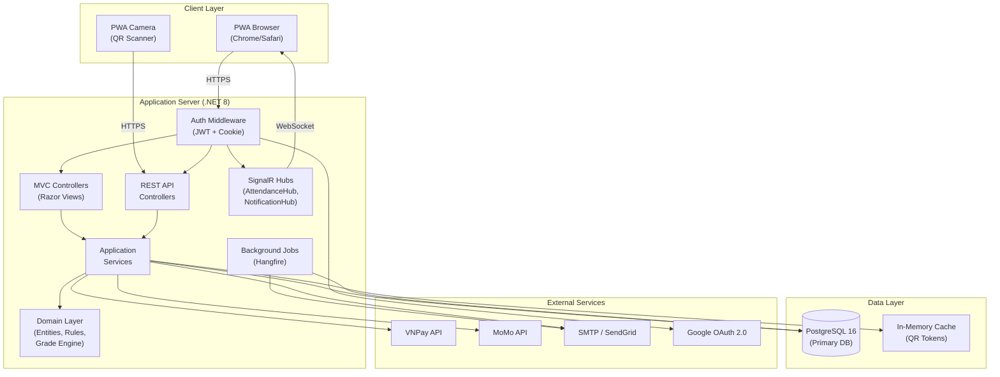
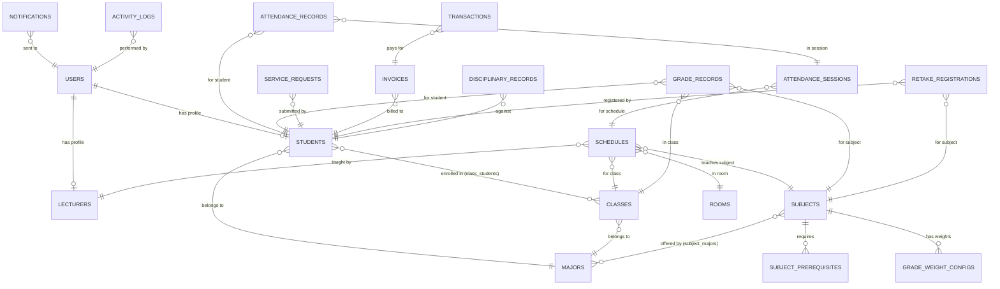

# Tài Liệu Thiết Kế Hệ Thống (System Design Document)

**Mục đích:** Tài liệu này mô tả kiến trúc hệ thống, các thành phần, giao diện tích hợp và luồng dữ liệu của **Hệ thống Quản Lý Sinh Viên (QLSV)**, nhằm đảm bảo hệ thống đáp ứng toàn bộ yêu cầu chức năng và phi chức năng được đặc tả trong BRD v5.2 và FSD v3.0. Tài liệu là kim chỉ nam cho đội phát triển, tester và các bên liên quan trong suốt vòng đời phát triển phần mềm.

---

## 1\. Tổng Quan

| **Thuộc tính** | **Nội dung** |
| --- | --- |
| **Tên hệ thống** | Hệ thống Quản Lý Sinh Viên (QLSV) |
| **Người biên soạn** | Khánh, Hiếu — ONENET |
| **Ngày** | 02/10/2026 |
| **Phiên bản** | 1.0 |
| **Tài liệu nguồn** | BRD-QLSV-v5.2, FSD-QLSV-v3.0, Bộ Mockup 41 file HTML |
| **Công nghệ chính** | C# / .NET 8.0 · PostgreSQL 16 · Visual Studio 2022 (Community/Professional) |
| **Triển khai** | Progressive Web App (PWA) · Self-hosted / Cloud VM |

---

## 2\. Mục Tiêu Hệ Thống

Hệ thống Quản Lý Sinh Viên được xây dựng nhằm:

| **Mã** | **Mục tiêu** | **KPI / Ngưỡng** |
| --- | --- | --- |
| G-01 | **Tự động hóa & Trung tâm hóa Quản lý Sinh viên:** Số hóa hồ sơ sinh viên (CCCD, địa chỉ), tự động cấp tài khoản và theo dõi trạng thái học tập xuyên suốt. | 100% hồ sơ SV số hóa; Import 1.000 bản ghi ≤ 10s |
| G-02 | **Số hóa Chương trình học & TKB Real-time:** Quản lý cây CTĐT, điều kiện tiên quyết, auto-scheduling TKB theo hệ thống Slot chuẩn FPT. | Auto-schedule 200 SV ≤ 30s; 0% Conflict |
| G-03 | **Hiện đại hóa Điểm danh & Cảnh báo chủ động:** Điểm danh QR Động refresh 10s, cảnh báo email khi SV chạm ngưỡng vắng 20%. | Xác thực QR ≤ 2s; Email cảnh báo ≤ 2 phút |
| G-04 | **Minh bạch hóa Quản lý Điểm số:** Tự động tính điểm tổng kết và xét Pass/Fail/Retake/Re-study theo quy chế FPT. | Tính điểm 200 SV ≤ 30s; Độ chính xác 100% |
| G-05 | **Số hóa Dịch vụ Hành chính:** Nộp đơn trực tuyến, xét duyệt, gửi email kết quả. | 100% đơn trực tuyến; Email ≤ 1 phút |
| G-06 | **Tích hợp Payment Gateway:** Gạch nợ tự động, đối soát giao dịch. | SSL/TLS; Export 5.000 dòng ≤ 15s |

---

## 3\. Phạm Vi

### 3.1. Trong phạm vi (In-scope)

| **Module** | **Mã** | **Phạm vi chức năng** |
| --- | --- | --- |
| Quản lý Sinh viên | QLSV-01 | Hồ sơ SV, trạng thái học tập (S0–S5), phân lớp chuyên ngành |
| Đào tạo & TKB | QLSV-02 | Cây CTĐT, danh mục GV/Phòng/Môn, xếp TKB, báo nghỉ/lịch bù |
| Điểm danh QR | QLSV-03 | QR Động 10s, PWA camera, sửa thủ công, cảnh báo vắng |
| Quản lý Điểm & Khảo thí | QLSV-04 | Nhập điểm TP, Rule Engine xét G0→G1/G3/G4/G5, chốt sổ |
| Dịch vụ Hành chính | QLSV-05 | Nộp/duyệt đơn từ, quản lý Profile, báo cáo & thống kê |
| Thanh toán | QLSV-06 | Tích hợp VNPay/MoMo, gạch nợ tự động/thủ công, đối soát |
| Học lại & Kỷ luật | QLSV-07 | Đăng ký học lại/thi lại, quản lý hồ sơ kỷ luật |
| Notification Center | QLSV-08 | Thông báo in-app, email bất đồng bộ, template HTML |

### 3.2. Ngoài phạm vi (Out-of-scope)

- Phân hệ Tuyển sinh đầu vào
- Quản lý Nhân sự & Lương Giảng viên
- Quản lý Thư viện / Ký túc xá
- Ứng dụng Native Mobile (iOS/Android) — Sử dụng PWA thay thế

---

## 4\. Giả Định và Ràng Buộc

### 4.1. Giả định

- Dữ liệu đầu vào (danh sách SV) được cung cấp dưới dạng Excel/CSV theo biểu mẫu chuẩn.
- Khung giờ Slot chuẩn (Slot 1: 07:30–09:50, Slot 2: 10:00–12:20, ...) được cấu hình tĩnh.
- Trường cung cấp mạng WiFi ổn định cho QR điểm danh.
- Trình duyệt mobile hỗ trợ WebRTC/Camera API (Chrome, Safari phiên bản hiện tại).
- PostgreSQL 16+ được cài đặt sẵn trên server triển khai.

### 4.2. Ràng buộc

- **Ngôn ngữ & Framework:** C# .NET 8.0 — ASP.NET Core MVC + Web API.
- **CSDL:** PostgreSQL 16 (thay thế MS SQL Server so với BRD gốc để tận dụng hiệu năng và chi phí mở).
- **IDE:** Visual Studio 2022 (Community hoặc Professional).
- **ORM:** Entity Framework Core 8 (EF Core) với Npgsql Provider.
- **Tích hợp Payment Gateway:** Phụ thuộc API bên thứ 3 (VNPay/MoMo).
- **Quy chế tính điểm:** Tuân thủ nghiêm ngặt quy chế đào tạo FPT hiện hành.
- **Triển khai:** Modular Monolithic, không microservices ở giai đoạn đầu.

---

## 5\. Các Bên Liên Quan

| **Nhóm** | **Vai trò** | **Trách nhiệm / Liên hệ** |
| --- | --- | --- |
| Khánh, Hiếu | BA / Developer | Biên soạn tài liệu, phát triển hệ thống |
| Quản nhiệm (VT-01) | Academic Staff | Quản trị hồ sơ SV, phân lớp, xếp TKB, duyệt đơn, đối soát giao dịch, quản lý hóa đơn, xuất báo cáo tài chính |
| Giảng viên (VT-02) | Lecturer | Mở QR điểm danh, nhập điểm, báo nghỉ |
| Sinh viên (VT-03) | Student | Quét QR, xem TKB/điểm, nộp đơn, thanh toán |
| Admin (VT-04) | System Admin | Toàn quyền hệ thống, sửa điểm sau chốt, CRUD tài khoản |

---

## 6\. Kiến Trúc Hệ Thống

### 6.1. Tổng Quan Kiến Trúc

Hệ thống được thiết kế theo kiến trúc **Modular Monolithic** kết hợp **Clean Architecture** (Domain-Centric), triển khai trên .NET 8.0 với mô hình MVC + Web API. Đây là lựa chọn phù hợp với quy mô dự án (1.000–1.500 SV, 50–100 GV) nhằm đảm bảo:

- **Đơn giản trong triển khai & vận hành** (1 deployment unit)
- **Phân tách rõ ràng** các module nghiệp vụ (QLSV-01 → QLSV-08)
- **Dễ dàng tách module** thành Microservices khi quy mô mở rộng

```
┌──────────────────────────────────────────────────────────────────────┐
│                        CLIENT (Browser / PWA)                        │
│  Razor Views + HTML/CSS/JS + SignalR Client + PWA Camera (QR Scan)  │
└────────────────────────────┬─────────────────────────────────────────┘
                             │ HTTPS (JWT Bearer)
                             ▼
┌──────────────────────────────────────────────────────────────────────┐
│                    ASP.NET CORE 8.0 APPLICATION                      │
│                                                                      │
│  ┌─────────────┐  ┌──────────────┐  ┌────────────────────────────┐  │
│  │ Controllers │  │  Razor Views │  │  API Endpoints (REST)      │  │
│  │ (MVC + API) │  │  (SSR Pages) │  │  /api/v1/{module}/{action} │  │
│  └──────┬──────┘  └──────────────┘  └────────────────────────────┘  │
│         │                                                            │
│  ┌──────▼────────────────────────────────────────────────────────┐   │
│  │              APPLICATION SERVICES LAYER                       │   │
│  │  StudentService · TrainingService · AttendanceService         │   │
│  │  GradeService · ServiceRequestService · PaymentService        │   │
│  │  RetakeService · NotificationService · AuthService            │   │
│  └──────┬────────────────────────────────────────────────────────┘   │
│         │                                                            │
│  ┌──────▼────────────────────────────────────────────────────────┐   │
│  │              DOMAIN LAYER (Business Rules)                    │   │
│  │  Entities · Value Objects · Enums (S0-S5, G0-G5)             │   │
│  │  Domain Events · Business Rule Validators (BR-001 → BR-051)  │   │
│  │  Grade Rule Engine · Scheduling Engine · QR Token Engine     │   │
│  └──────┬────────────────────────────────────────────────────────┘   │
│         │                                                            │
│  ┌──────▼────────────────────────────────────────────────────────┐   │
│  │              INFRASTRUCTURE LAYER                             │   │
│  │  EF Core 8 (Npgsql) · Repositories · Unit of Work            │   │
│  │  SignalR Hubs · Email Service · Payment Gateway Client        │   │
│  │  Background Jobs (Hangfire) · File Storage · Audit Logger     │   │
│  └──────┬────────────────────────────────────────────────────────┘   │
│         │                                                            │
└─────────┼────────────────────────────────────────────────────────────┘
          │
          ▼
┌──────────────────────────┐   ┌───────────────┐   ┌──────────────┐
│   PostgreSQL 16          │   │ VNPay / MoMo  │   │ SMTP/SendGrid│
│   (Primary Database)     │   │ Payment API   │   │ Email Service│
└──────────────────────────┘   └───────────────┘   └──────────────┘
                                                   ┌──────────────┐
                                                   │ Google OAuth │
                                                   │ 2.0 (SSO)   │
                                                   └──────────────┘
```

### 6.2. Kiến Trúc Phân Lớp Chi Tiết (Layered Architecture)

| **Lớp** | **Tên** | **Thành phần** | **Công nghệ** |
| --- | --- | --- | --- |
| L1 | **Presentation** | Razor Views (.cshtml), HTML/CSS/JS, Bootstrap 5, SignalR Client, PWA manifest, Service Worker | ASP.NET Core MVC Views |
| L2 | **Controllers** | MVC Controllers (render phía server), API Controllers (REST JSON) | ASP.NET Core Controllers |
| L3 | **Application** | Các lớp Service, DTOs, Mappers, Command/Query handlers, Validators (FluentValidation) | C# Class Library |
| L4 | **Domain** | Các lớp Entity, Value Objects, Enums, Domain Events, đặc tả Business Rule | C# Class Library (không phụ thuộc bên ngoài) |
| L5 | **Infrastructure** | EF Core DbContext, Repositories, Migrations, SignalR Hubs, Client tích hợp bên ngoài, Background Jobs | EF Core 8 + Npgsql, Hangfire, MailKit |
| L6 | **Database** | PostgreSQL 16 — Bảng, Views, Indexes, Functions, Triggers | PostgreSQL |
| L7 | **External** | VNPay/MoMo API, SMTP/SendGrid, Google OAuth 2.0 | REST/OAuth/SMTP |

### 6.3. Các Thành Phần Chi Tiết

#### 6.3.1. Cấu Trúc Solution (Visual Studio 2022)

```
📁 QLSV.sln
│
├── 📁 src/
│   ├── 📁 QLSV.Domain/                    ← Domain Layer (Class Library)
│   │   ├── 📁 Entities/
│   │   │   ├── Student.cs                  ← TT-01 Hồ sơ Sinh viên
│   │   │   ├── UserAccount.cs              ← TT-02 Tài khoản
│   │   │   ├── Class.cs                    ← TT-03 Lớp chuyên ngành
│   │   │   ├── Subject.cs                  ← TT-04 Môn học
│   │   │   ├── Major.cs                    ← TT-05 Chuyên ngành
│   │   │   ├── Schedule.cs                 ← TT-06 TKB
│   │   │   ├── AttendanceSession.cs        ← TT-07 Phiên điểm danh
│   │   │   ├── AttendanceRecord.cs         ← TT-08 Bản ghi điểm danh
│   │   │   ├── GradeRecord.cs              ← TT-09 Bảng điểm
│   │   │   ├── ServiceRequest.cs           ← TT-10 Đơn từ
│   │   │   ├── Invoice.cs                  ← TT-11 Hóa đơn
│   │   │   ├── Transaction.cs              ← TT-12 Giao dịch
│   │   │   ├── Room.cs                     ← TT-13 Phòng học
│   │   │   ├── ActivityLog.cs              ← TT-14 Activity Log
│   │   │   ├── RetakeRegistration.cs       ← TT-15 ĐK Học lại
│   │   │   ├── DisciplinaryRecord.cs       ← TT-16 Hồ sơ Kỷ luật
│   │   │   ├── Lecturer.cs                 ← TT-17 Giảng viên
│   │   │   ├── Notification.cs             ← TT-18 Thông báo
│   │   │   ├── SubjectPreRequisite.cs      ← TT-19 Tiên quyết
│   │   │   ├── GradeWeightConfig.cs        ← TT-20 Tỷ trọng điểm
│   │   │   └── Curriculum.cs               ← TT-05 CTĐT
│   │   ├── 📁 Enums/
│   │   │   ├── StudentStatus.cs            ← S0–S5
│   │   │   ├── GradeStatus.cs              ← G0, G1, G3, G4, G5
│   │   │   ├── AccountStatus.cs            ← Active/Locked/Disabled/Limited
│   │   │   ├── InvoiceStatus.cs            ← Unpaid/Paid/Overdue/Cancelled
│   │   │   ├── TransactionStatus.cs        ← Pending/Success/Failed
│   │   │   ├── RequestStatus.cs            ← Pending/Processing/Approved/Rejected/Cancelled
│   │   │   ├── ScheduleSlotStatus.cs       ← Normal/Cancelled/MakeUp
│   │   │   ├── AttendanceStatus.cs         ← Present/Absent
│   │   │   ├── UserRole.cs                 ← Admin/QuanNhiem/GiangVien/SinhVien
│   │   │   └── NotificationType.cs         ← Info/Warning/Success/Danger
│   │   ├── 📁 ValueObjects/
│   │   │   ├── CCCD.cs                     ← Value Object [0-9]{12}
│   │   │   ├── StudentId.cs                ← [A-Z]{2}[0-9]{6}
│   │   │   └── PhoneNumber.cs              ← SĐT Việt Nam
│   │   ├── 📁 Events/
│   │   │   ├── StudentCreatedEvent.cs
│   │   │   ├── StudentStatusChangedEvent.cs
│   │   │   ├── AttendanceMarkedEvent.cs
│   │   │   ├── GradeLockedEvent.cs
│   │   │   ├── PaymentSuccessEvent.cs
│   │   │   └── ...
│   │   ├── 📁 Interfaces/
│   │   │   ├── IStudentRepository.cs
│   │   │   ├── IGradeRepository.cs
│   │   │   ├── IUnitOfWork.cs
│   │   │   └── ...
│   │   └── 📁 Specifications/             ← Business Rule Validators
│   │       ├── GradeRuleEngine.cs          ← BR-017,021,022,022b,023,024
│   │       ├── SchedulingConstraints.cs    ← BR-008,009,010
│   │       ├── QRTokenValidator.cs         ← BR-013,014,016
│   │       └── PasswordPolicy.cs           ← BR-048,049
│   │
│   ├── 📁 QLSV.Application/               ← Application Layer (Class Library)
│   │   ├── 📁 DTOs/
│   │   │   ├── StudentDto.cs
│   │   │   ├── GradeDto.cs
│   │   │   ├── LoginDto.cs
│   │   │   ├── InvoiceDto.cs
│   │   │   └── ...
│   │   ├── 📁 Services/
│   │   │   ├── AuthService.cs              ← UC-01: Đăng nhập & SSO
│   │   │   ├── StudentService.cs           ← UC-02,03,04: Hồ sơ SV
│   │   │   ├── TrainingService.cs          ← UC-05,06,07,08: Đào tạo & TKB
│   │   │   ├── AttendanceService.cs        ← UC-09: Điểm danh QR
│   │   │   ├── GradeService.cs             ← UC-10,11: Quản lý điểm
│   │   │   ├── RetakeService.cs            ← UC-12: Học lại/Thi lại
│   │   │   ├── ProfileService.cs           ← UC-13: Profile & Password
│   │   │   ├── ServiceRequestService.cs    ← UC-14: Đơn từ
│   │   │   ├── ReportService.cs            ← UC-15: Báo cáo
│   │   │   ├── PaymentService.cs           ← UC-16: Thanh toán
│   │   │   └── NotificationService.cs      ← QLSV-08: Thông báo
│   │   ├── 📁 Validators/                  ← FluentValidation rules
│   │   │   ├── StudentValidator.cs         ← VLD-QLSV-01,08,09,10,16
│   │   │   ├── GradeValidator.cs           ← VLD-QLSV-04,05
│   │   │   ├── PasswordValidator.cs        ← VLD-QLSV-06
│   │   │   └── ...
│   │   ├── 📁 Mappers/
│   │   │   └── AutoMapperProfile.cs
│   │   └── 📁 Interfaces/
│   │       ├── IAuthService.cs
│   │       ├── IStudentService.cs
│   │       └── ...
│   │
│   ├── 📁 QLSV.Infrastructure/            ← Infrastructure Layer (Class Library)
│   │   ├── 📁 Data/
│   │   │   ├── QLSVDbContext.cs            ← EF Core DbContext (Npgsql)
│   │   │   ├── 📁 Configurations/         ← Fluent API entity configs
│   │   │   │   ├── StudentConfiguration.cs
│   │   │   │   ├── GradeRecordConfiguration.cs
│   │   │   │   └── ...
│   │   │   ├── 📁 Migrations/             ← EF Core Migrations (PostgreSQL)
│   │   │   └── 📁 Repositories/
│   │   │       ├── StudentRepository.cs
│   │   │       ├── GradeRepository.cs
│   │   │       ├── UnitOfWork.cs
│   │   │       └── ...
│   │   ├── 📁 ExternalServices/
│   │   │   ├── VnPayService.cs             ← TH-01: VNPay integration
│   │   │   ├── MoMoService.cs              ← TH-01: MoMo integration
│   │   │   ├── EmailService.cs             ← TH-02: SendGrid/SMTP
│   │   │   ├── GoogleAuthService.cs        ← TH-03: Google OAuth 2.0
│   │   │   └── QRTokenService.cs           ← QR Token AES-256
│   │   ├── 📁 BackgroundJobs/
│   │   │   ├── OverdueInvoiceJob.cs        ← BR-045: Unpaid → Overdue
│   │   │   ├── SuspensionExpiryJob.cs      ← BR-041: S5 → S1
│   │   │   ├── ReservationExpiryJob.cs     ← BR-005b: S2 → S3
│   │   │   ├── NotificationCleanupJob.cs   ← BR-047: TTL 90 ngày
│   │   │   └── PaymentSessionExpiryJob.cs  ← BR-030: Session 15 phút
│   │   ├── 📁 SignalR/
│   │   │   ├── AttendanceHub.cs            ← Real-time QR attendance
│   │   │   └── NotificationHub.cs          ← Real-time notifications
│   │   └── 📁 Logging/
│   │       └── AuditLogService.cs          ← BR-051: Audit trail
│   │
│   └── 📁 QLSV.Web/                       ← Presentation Layer (ASP.NET Core Web App)
│       ├── 📁 Controllers/
│       │   ├── 📁 Mvc/                     ← Server-rendered pages
│       │   │   ├── HomeController.cs
│       │   │   ├── AuthController.cs       ← MH-00-5, MH-00-6
│       │   │   ├── DashboardController.cs  ← MH-00-1,7,8,9
│       │   │   ├── StudentController.cs    ← MH-01-1→MH-01-8
│       │   │   ├── TrainingController.cs   ← MH-02-1→MH-02-6
│       │   │   ├── AttendanceController.cs ← MH-03-1→MH-03-3
│       │   │   ├── GradeController.cs      ← MH-04-1→MH-04-3
│       │   │   ├── ServiceController.cs    ← MH-05-1→MH-05-5
│       │   │   ├── PaymentController.cs    ← MH-06-1→MH-06-2
│       │   │   └── AdminController.cs      ← MH-00-2→MH-00-4
│       │   └── 📁 Api/                     ← REST API endpoints
│       │       ├── AuthApiController.cs
│       │       ├── StudentApiController.cs
│       │       ├── AttendanceApiController.cs
│       │       ├── GradeApiController.cs
│       │       ├── PaymentApiController.cs
│       │       └── WebhookController.cs    ← IPN Callback endpoint
│       ├── 📁 Views/                       ← Razor Views (.cshtml)
│       │   ├── 📁 Shared/
│       │   │   ├── _Layout.cshtml          ← Master layout (sidebar + topbar)
│       │   │   ├── _AdminLayout.cshtml
│       │   │   └── _LoginLayout.cshtml     ← Glassmorphism layout
│       │   ├── 📁 Auth/
│       │   │   ├── AdminLogin.cshtml       ← MH-00-5
│       │   │   └── Login.cshtml            ← MH-00-6
│       │   ├── 📁 Dashboard/
│       │   │   ├── AdminDashboard.cshtml   ← MH-00-1
│       │   │   ├── QNDashboard.cshtml      ← MH-00-7
│       │   │   ├── GVDashboard.cshtml      ← MH-00-8
│       │   │   └── SVDashboard.cshtml      ← MH-00-9
│       │   └── ... (theo module)
│       ├── 📁 wwwroot/
│       │   ├── 📁 css/
│       │   │   ├── site.css
│       │   │   └── modules/                ← CSS per module
│       │   ├── 📁 js/
│       │   │   ├── site.js
│       │   │   ├── signalr-client.js
│       │   │   ├── qr-scanner.js           ← PWA Camera QR
│       │   │   └── modules/
│       │   ├── 📁 lib/                     ← Bootstrap 5, jQuery, Chart.js
│       │   ├── manifest.json               ← PWA Manifest
│       │   └── service-worker.js           ← PWA Service Worker
│       ├── Program.cs                      ← .NET 8 Minimal Hosting
│       ├── appsettings.json                ← Config: DB, JWT, VNPay, SMTP...
│       └── appsettings.Development.json
│
├── 📁 tests/
│   ├── 📁 QLSV.Domain.Tests/              ← Unit Tests (xUnit)
│   ├── 📁 QLSV.Application.Tests/
│   └── 📁 QLSV.IntegrationTests/          ← Integration Tests (TestContainers + PostgreSQL)
│
└── 📁 docs/
    ├── BRD/
    ├── FSD/
    └── SystemDesign/
```

#### 6.3.2. Mô Tả Các Thành Phần

| **Thành phần** | **Mô tả** | **Trách nhiệm** |
| --- | --- | --- |
| **QLSV.Domain** | Lõi nghiệp vụ, không phụ thuộc framework. Chứa Entity, Enum, Value Object, Domain Event, Business Rule. | Đảm bảo quy tắc BR-001→BR-051 được kiểm tra tại nguồn |
| **QLSV.Application** | Orchestrator giữa Domain và Infrastructure. Chứa Service classes, DTOs, Validators. | Điều phối use case UC-01→UC-16, validation VLD-01→VLD-22 |
| **QLSV.Infrastructure** | Triển khai cụ thể: EF Core, Repository, SignalR Hub, Background Job, External API Client. | Tương tác DB, gửi email, xử lý thanh toán, real-time |
| **QLSV.Web** | Presentation: MVC Controllers, Razor Views, API endpoints, PWA assets. | Nhận request HTTP, render UI, trả JSON |
| **PostgreSQL** | Lưu trữ toàn bộ dữ liệu hệ thống. | Persistence, transaction, indexing |
| **Hangfire** | Scheduled & Background Jobs. | Overdue check, Suspension expiry, Notification cleanup |
| **SignalR** | Real-time communication. | QR refresh, attendance push, notification push |

### 6.4. Sơ Đồ Hệ Thống



---

## 7\. Thiết Kế Dữ Liệu

### 7.1. Tổng quan Luồng dữ liệu

Dữ liệu trong hệ thống được quản lý tập trung tại PostgreSQL, luồng chính:

1. **Input:** Import Excel/CSV → Validate → Lưu Entity → Tạo tài khoản tự động
2. **Processing:** Điểm danh (QR Token → Validate → AttendanceRecord) → Nhập điểm (GradeRecord) → Rule Engine tự động xét G0→G1/G3/G4/G5
3. **Output:** Dashboard charts, Excel/PDF export, Email notification, Payment URL redirect

### 7.2. Các Thực Thể Dữ Liệu — Bảng Cơ Sở Dữ Liệu PostgreSQL

| **Bảng (Table)** | **Mã BRD** | **Mô tả** | **Số cột ước tính** |
| --- | --- | --- | --- |
| `users` | TT-02 | Tài khoản người dùng (username, hash, role, status, failed_attempts, locked_until) | 12 |
| `students` | TT-01 | Hồ sơ sinh viên (student_id, full_name, cccd, dob, email, phone, ethnicity, address, status S0-S5) | 15 |
| `lecturers` | TT-17 | Hồ sơ giảng viên (lecturer_code, full_name, department, email, phone) | 8 |
| `majors` | TT-05 | Chuyên ngành (major_code, name, description) | 5 |
| `classes` | TT-03 | Lớp chuyên ngành (class_code, major_id, semester, max_capacity, current_size) | 8 |
| `class_students` | — | Bảng liên kết N-N: SV ↔ Lớp | 4 |
| `subjects` | TT-04 | Môn học (subject_code, name, credits, total_slots) | 8 |
| `subject_majors` | — | Bảng liên kết N-N: Môn ↔ Chuyên ngành | 3 |
| `subject_prerequisites` | TT-19 | Quan hệ tiên quyết giữa các môn | 4 |
| `curricula` | TT-05 | CTĐT: Chuyên ngành → Học kỳ → Danh sách môn | 5 |
| `rooms` | TT-13 | Phòng học (room_code, capacity, room_type, is_active) | 6 |
| `schedules` | TT-06 | TKB (class_id, subject_id, lecturer_id, room_id, day_of_week, slot, semester, status) | 14 |
| `attendance_sessions` | TT-07 | Phiên điểm danh (session_id, schedule_id, status Opening/Closed, qr_token, opened_at) | 8 |
| `attendance_records` | TT-08 | Bản ghi điểm danh (session_id, student_id, status Present/Absent, is_manual, manual_reason, timestamp) | 10 |
| `grade_weight_configs` | TT-20 | Cấu hình tỷ trọng điểm theo môn (subject_id, component_name, weight) | 6 |
| `grade_records` | TT-09 | Bảng điểm (student_id, subject_id, class_id, semester, quiz1, quiz2, asm, pe, fe, total, status G0-G5, is_locked) | 18 |
| `service_requests` | TT-10 | Đơn từ (request_id, student_id, type, content, attachment_url, status, reviewer_note, reviewed_by) | 14 |
| `invoices` | TT-11 | Hóa đơn (invoice_id, student_id, semester, description, amount, due_date, status, paid_date) | 12 |
| `transactions` | TT-12 | Giao dịch TT (txn_id, invoice_id, gateway, amount, status, gateway_ref, checksum, source, manual_reason) | 14 |
| `retake_registrations` | TT-15 | ĐK Học lại (student_id, subject_id, original_semester, attempt, fee, status) | 10 |
| `disciplinary_records` | TT-16 | Hồ sơ kỷ luật (student_id, reason, start_date, end_date, status Active/Expired) | 8 |
| `notifications` | TT-18 | Thông báo in-app (user_id, type, title, body, is_read, channel, created_at) | 10 |
| `activity_logs` | TT-14 | Audit trail (user_id, action, entity, entity_id, old_value, new_value, ip_address, timestamp) | 12 |
| `refresh_tokens` | — | JWT Refresh Token storage | 6 |
| `password_history` | — | Lưu 3 mật khẩu gần nhất (BR-048) | 5 |

**Tổng cộng: ~24 bảng chính**

### 7.3. Sơ Đồ Quan Hệ Thực Thể (ERD)



### 7.4. Cấu Hình Cơ Sở Dữ Liệu (PostgreSQL)

```
# appsettings.json — Connection String
{
  "ConnectionStrings": {
    "DefaultConnection": "Host=localhost;Port=5432;Database=qlsv_db;Username=qlsv_app;Password=***;Include Error Detail=true"
  }
}
```

**Chiến lược đánh Index:**

| **Bảng** | **Index** | **Lý do** |
| --- | --- | --- |
| `students` | UNIQUE(student_id), UNIQUE(cccd), UNIQUE(email) | BR-001, BR-002 |
| `users` | UNIQUE(username), UNIQUE(email) | Login lookup |
| `schedules` | COMPOSITE(lecturer_id, day_of_week, slot, semester) | BR-008: Chống trùng GV |
| `schedules` | COMPOSITE(room_id, day_of_week, slot, semester) | BR-009: Chống trùng Phòng |
| `attendance_records` | COMPOSITE(session_id, student_id) UNIQUE | BR-015: 1 SV / 1 phiên |
| `invoices` | INDEX(student_id, status) | Query hóa đơn Unpaid/Overdue |
| `grade_records` | COMPOSITE(student_id, subject_id, class_id) | Lookup nhanh bảng điểm |
| `activity_logs` | INDEX(created_at), INDEX(entity, entity_id) | Audit trail query |
| `notifications` | INDEX(user_id, is_read, created_at) | Notification bell count |

### 7.5. Sơ Đồ Luồng Dữ Liệu

- **DFD-01 — Luồng Xác thực:** User → Login Form → AuthService → DB (verify hash) → JWT Token → Redirect Dashboard
- **DFD-02 — Luồng Import SV:** Excel/CSV → Upload → Validate (BR-001,002) → Batch Insert students + users → Activity Log
- **DFD-03 — Luồng Điểm danh QR:** GV Mở phiên → Server sinh AES-256 Token → SignalR push QR → SV quét → API verify → Update AttendanceRecord → SignalR push kết quả
- **DFD-04 — Luồng Xét điểm:** GV nhập điểm → Lưu GradeRecord → QN chốt sổ → Rule Engine chạy → Update G0→G1/G3/G4/G5 → Notification SV
- **DFD-05 — Luồng Thanh toán:** SV chọn hóa đơn → Gen Payment URL (15m TTL) → Redirect Gateway → Webhook IPN → Verify HMAC → Gạch nợ → Notification

---

## 8\. Giao Diện Tích Hợp

### 8.1. Giao Diện Bên Ngoài

| **Mã** | **Hệ thống** | **Giao thức** | **Chiều dữ liệu** | **Mô tả** |
| --- | --- | --- | --- | --- |
| TH-01a | **VNPay** | REST API + Webhook (IPN) | Hệ thống → VNPay: Tạo Payment URL (vnp_TxnRef, vnp_Amount, HMAC SHA512). VNPay → Hệ thống: IPN callback | Thanh toán học phí. Session 15 phút (BR-030). Verify Checksum (BR-031). |
| TH-01b | **MoMo** | REST API + Webhook (IPN) | Tương tự VNPay, dùng HMAC SHA256 | Phương thức thanh toán thay thế. |
| TH-02 | **SMTP / SendGrid** | SMTP / REST API | Outbound only | Gửi email cảnh báo vắng, kết quả duyệt đơn, thông tin tài khoản. Background Queue (Hangfire), Retry 3x. |
| TH-03 | **Google OAuth 2.0** | OAuth 2.0 Authorization Code Flow | Google → Hệ thống: ID Token | SSO cho GV/SV. Giới hạn domain @fpt.edu.vn (BR-050). |

### 8.2. Giao Diện Nội Bộ

| **Interface** | **Mô tả** |
| --- | --- |
| **SignalR AttendanceHub** | Real-time push: QR token refresh 10s, SV quét thành công → tô xanh dòng trên UI GV, stats update |
| **SignalR NotificationHub** | Push notification in-app real-time khi có sự kiện (duyệt đơn, lịch bù, cảnh báo) |
| **REST API /api/v1/** | Internal JSON API cho AJAX calls từ Razor Views (DataTable, Form submit, Export) |
| **Hangfire Dashboard** | Admin-only dashboard theo dõi Background Jobs |
| **EF Core DbContext** | Interface duy nhất giữa Application Layer và PostgreSQL qua Repository pattern |

### 8.3. Các API Endpoint Chính (REST)

| **Method** | **Endpoint** | **Mô tả** | **Auth** |
| --- | --- | --- | --- |
| POST | `/api/v1/auth/login` | Đăng nhập bằng username/password | Public |
| POST | `/api/v1/auth/google` | Đăng nhập SSO Google | Public |
| POST | `/api/v1/auth/refresh` | Refresh JWT Token | Bearer |
| GET | `/api/v1/students` | Danh sách SV (phân trang, filter) | QN, Admin |
| POST | `/api/v1/students/import` | Import Excel/CSV | QN |
| PUT | `/api/v1/students/{id}/status` | Cập nhật trạng thái SV | QN, Admin |
| POST | `/api/v1/classes/{id}/assign` | Phân lớp SV | QN |
| GET | `/api/v1/schedules` | Xem TKB | All (filter by role) |
| POST | `/api/v1/schedules/auto-generate` | Auto-scheduling TKB | QN |
| POST | `/api/v1/attendance/sessions` | Mở phiên điểm danh | GV |
| POST | `/api/v1/attendance/scan` | SV quét QR | SV |
| PUT | `/api/v1/attendance/manual` | Sửa điểm danh thủ công | GV, QN |
| GET | `/api/v1/grades/{classId}/{subjectId}` | Bảng điểm lớp | GV |
| PUT | `/api/v1/grades/batch` | Lưu batch điểm | GV |
| POST | `/api/v1/grades/lock` | Chốt sổ điểm | QN |
| POST | `/api/v1/service-requests` | Nộp đơn từ | SV |
| PUT | `/api/v1/service-requests/{id}/review` | Duyệt/từ chối đơn | QN |
| GET | `/api/v1/invoices` | Danh sách hóa đơn | SV (của mình), QN |
| POST | `/api/v1/payments/create-url` | Tạo Payment URL | SV |
| POST | `/api/v1/webhooks/vnpay` | IPN callback VNPay | VNPay (IP whitelist) |
| POST | `/api/v1/webhooks/momo` | IPN callback MoMo | MoMo (IP whitelist) |
| POST | `/api/v1/retake/register` | Đăng ký học lại/thi lại | SV |
| GET | `/api/v1/reports/{type}` | Báo cáo thống kê | QN, Admin |
| GET | `/api/v1/reports/export` | Xuất Excel/PDF | QN, Admin |

---

## 9\. Bảo Mật Hệ Thống

### 9.1. Xác thực & Phân quyền

| **Khía cạnh** | **Giải pháp** | **Tham chiếu** |
| --- | --- | --- |
| **Xác thực** | JWT Bearer Token (Access 30m, Refresh 7d) + Cookie Auth cho Razor Views | NFR-12 |
| **SSO** | Google OAuth 2.0 — Chỉ chấp nhận email @fpt.edu.vn | BR-050 |
| **Phân quyền** | Role-Based Access Control (RBAC) — 4 vai trò: Admin, QuanNhiem, GiangVien, SinhVien | Chương 9 BRD |
| **Mật khẩu** | Hash Argon2id (hoặc BCrypt). ≥8 ký tự, 1 hoa, 1 số, 1 đặc biệt. Không trùng 3 MK gần nhất. | BR-048, NFR-10 |
| **Chống Brute Force** | Khóa tài khoản 15 phút sau 5 lần sai liên tiếp | BR-049, NFR-11 |
| **Rate Limiting** | ASP.NET Core Rate Limiter middleware | Phòng DDoS |

### 9.2. Bảo mật dữ liệu

| **Khía cạnh** | **Giải pháp** |
| --- | --- |
| **Truyền tải** | HTTPS/TLS 1.2+ bắt buộc (HSTS header) |
| **QR Token** | Mã hóa AES-256-CBC, expire 10s, chỉ PWA giải mã (BR-013, BR-014) |
| **Payment** | HMAC SHA512 verify Checksum. Không lưu thông tin thẻ (BR-031) |
| **Dữ liệu cá nhân** | Tuân thủ Nghị Định 13/2023/NĐ-CP. Mã hóa CCCD tại rest (Column-level encryption) |
| **Audit Trail** | Mọi thao tác sửa điểm, gạch nợ, duyệt đơn → ghi Log vĩnh viễn (who/when/what/old/new) — BR-051 |
| **SQL Injection** | EF Core parameterized queries. Không dùng raw SQL trực tiếp |
| **XSS** | Razor auto-encoding. Content Security Policy headers |
| **CSRF** | ASP.NET Core AntiForgery Token |

### 9.3. Ma Trận Phân Quyền RBAC (Tóm Tắt)

| **Chức năng** | **Admin** | **QN** | **GV** | **SV** |
| --- | --- | --- | --- | --- |
| CRUD Tài khoản | ✅ | — | — | — |
| Import SV | R | CRUD | — | — |
| Phân lớp | R | CRU | — | R |
| Xếp TKB | R | CRUD | R | R |
| Mở QR Điểm danh | R | — | CRU | — |
| Quét QR | — | — | — | X |
| Nhập điểm | R | — | CRU | R |
| Sửa điểm sau chốt | U(Log) | — | — | — |
| Duyệt đơn từ | R | RU | — | R(mình) |
| Thanh toán | — | — | — | X |
| Đối soát giao dịch | R | RU | — | — |
| Quản lý Hóa đơn | CRUD | CRU | — | R(mình) |
| Xem Activity Log | R | R(TC) | — | — |
| Báo cáo | R | R(tất cả) | R(mình) | — |

---

## 10\. Yêu Cầu Hiệu Năng

| **Mã** | **Yêu cầu** | **Ngưỡng** | **Cách đo** |
| --- | --- | --- | --- |
| NFR-01 | Đăng nhập & cấp JWT Token | ≤ 1 giây (P95) | Load test (k6/JMeter) |
| NFR-02 | Import 1.000 bản ghi SV | ≤ 10 giây | Automated test + đo thời gian |
| NFR-03 | Xác thực QR điểm danh | ≤ 2 giây | Test 200 SV concurrent |
| NFR-04 | Auto-scheduling TKB (200 SV) | ≤ 30 giây, 0% Conflict | Automated test |
| NFR-05 | Kiểm tra vòng lặp tiên quyết (DFS) | ≤ 2 giây | Unit test |
| NFR-06 | Rule Engine tính điểm 200 SV | ≤ 30 giây | Automated test + so khớp |
| NFR-07 | Tải báo cáo Dashboard | ≤ 5 giây | Browser DevTools |
| NFR-08 | Xuất Excel 5.000 dòng | ≤ 15 giây | Automated test |
| NFR-09 | Giao tiếp Payment Gateway | SSL/TLS bắt buộc | Certificate check |
| NFR-12 | Concurrent QR scan | 200 SV đồng thời | SignalR stress test |
| NFR-14 | Backup PostgreSQL | Daily backup, lưu 30 ngày | pg_dump cron job |
| NFR-15 | System Uptime | ≥ 99.5% | Monitoring (Uptime Robot) |

### Chiến Lược Tối Ưu Hóa

| **Kỹ thuật** | **Áp dụng** |
| --- | --- |
| **Connection Pooling** | Npgsql connection pool (default 100 connections) |
| **Response Caching** | Cache danh mục tĩnh (Majors, Rooms, Slots) — IMemoryCache |
| **Batch Operations** | Bulk Insert cho Import SV (EF Core `AddRange` + `SaveChangesAsync`) |
| **Background Processing** | Hangfire cho email, overdue check, cleanup — không block request thread |
| **Pagination** | Server-side pagination cho mọi DataTable (PageSize = 20/50/100) |
| **Async/Await** | 100% async I/O operations (DB, HTTP, Email) |
| **Index Strategy** | Composite indexes cho các truy vấn phức tạp (xem mục 7.4) |

---

## 11\. Bảng Thuật Ngữ

| **Thuật ngữ** | **Định nghĩa** |
| --- | --- |
| SV | Sinh viên |
| GV | Giảng viên |
| QN | Quản nhiệm (Academic Staff) |
| TKB | Thời khóa biểu |
| CTĐT | Chương trình đào tạo |
| Slot | Khung giờ học chuẩn FPT (VD: Slot 1 = 07:30–09:50) |
| Block | Đơn vị thời gian học (5–7 tuần) trong 1 học kỳ |
| FE | Final Exam — Bài thi cuối kỳ |
| TP | Thành phần — Điểm quá trình (Quiz, Assignment, Lab) |
| QR Token | Chuỗi mã hóa AES-256 động nhúng trong QR Code, refresh 10s |
| PWA | Progressive Web App |
| IPN/Webhook | Instant Payment Notification — Callback từ cổng thanh toán |
| RBAC | Role-Based Access Control |
| SSO | Single Sign-On (Google OAuth 2.0) |
| CCCD | Căn Cước Công Dân |
| MSSV | Mã số sinh viên |
| S0–S5 | Trạng thái sinh viên: Initialized/Active/Suspended/Dropped/Graduated/Disciplinary |
| G0–G5 | Trạng thái môn: In Progress/Passed/(skip G2)/Fail/Retake/Re-study |
| EF Core | Entity Framework Core — ORM cho .NET |
| Npgsql | .NET Data Provider cho PostgreSQL |
| Hangfire | Thư viện .NET cho Background Jobs |
| SignalR | Thư viện .NET cho Real-time Communication (WebSocket) |
| FluentValidation | Thư viện .NET cho Input Validation |
| AutoMapper | Thư viện .NET cho Object-to-Object Mapping |
| Argon2id | Thuật toán hash mật khẩu (được OWASP khuyến nghị) |

---

## 12\. Phụ Lục

### Phụ Lục A — Technology Stack Chi Tiết

| **Lớp** | **Công nghệ** | **Phiên bản** | **Mục đích** | **NuGet Package** |
| --- | --- | --- | --- | --- |
| Runtime | .NET | 8.0 LTS | Framework chính | — |
| Web Framework | ASP.NET Core MVC + Web API | 8.0 | Controllers, Views, API | `Microsoft.AspNetCore.App` |
| ORM | Entity Framework Core | 8.0 | Data Access, Migrations | `Microsoft.EntityFrameworkCore` |
| PostgreSQL Provider | Npgsql EF Core | 8.0 | PostgreSQL adapter | `Npgsql.EntityFrameworkCore.PostgreSQL` |
| Authentication | ASP.NET Core Identity (Lite) | 8.0 | JWT + Cookie Auth | `Microsoft.AspNetCore.Authentication.JwtBearer` |
| OAuth | Google OAuth 2.0 | — | SSO | `Microsoft.AspNetCore.Authentication.Google` |
| Real-time | SignalR | 8.0 | WebSocket communication | `Microsoft.AspNetCore.SignalR` |
| Background Jobs | Hangfire | 1.8+ | Scheduled tasks | `Hangfire.AspNetCore`, `Hangfire.PostgreSql` |
| Validation | FluentValidation | 11+ | Input validation | `FluentValidation.AspNetCore` |
| Mapping | AutoMapper | 13+ | DTO ↔ Entity mapping | `AutoMapper.Extensions.Microsoft.DependencyInjection` |
| Email | MailKit | 4+ | SMTP client | `MailKit` |
| Excel | ClosedXML | 0.102+ | Import/Export Excel | `ClosedXML` |
| PDF | QuestPDF | 2024+ | Xuất PDF | `QuestPDF` |
| QR Code | QRCoder | 1.5+ | Sinh QR Code image | `QRCoder` |
| Encryption | System.Security.Cryptography | — | AES-256 cho QR Token | Built-in |
| Hashing | Isopoh.Cryptography.Argon2 | 2+ | Password hashing | `Isopoh.Cryptography.Argon2` |
| Logging | Serilog | 4+ | Structured logging | `Serilog.AspNetCore`, `Serilog.Sinks.PostgreSQL` |
| Caching | IMemoryCache | — | In-memory cache | Built-in |
| Frontend | Bootstrap 5 | 5.3 | CSS Framework | CDN/npm |
| Charts | Chart.js | 4+ | Dashboard charts | CDN |
| DataTable | jQuery DataTables | 2+ | Server-side paging | CDN |
| Testing | xUnit + Moq + TestContainers | — | Unit & Integration Tests | NuGet |

### Phụ Lục B — Hướng Dẫn Khởi Tạo Dự Án (Visual Studio 2022)

**Bước 1: Tạo Solution**

```bash
# Mở Developer Command Prompt hoặc Terminal trong Visual Studio
dotnet new sln -n QLSV

# Tạo các project
dotnet new classlib -n QLSV.Domain -f net8.0
dotnet new classlib -n QLSV.Application -f net8.0
dotnet new classlib -n QLSV.Infrastructure -f net8.0
dotnet new mvc -n QLSV.Web -f net8.0
dotnet new xunit -n QLSV.Domain.Tests -f net8.0
dotnet new xunit -n QLSV.Application.Tests -f net8.0

# Thêm vào solution
dotnet sln add src/QLSV.Domain/QLSV.Domain.csproj
dotnet sln add src/QLSV.Application/QLSV.Application.csproj
dotnet sln add src/QLSV.Infrastructure/QLSV.Infrastructure.csproj
dotnet sln add src/QLSV.Web/QLSV.Web.csproj
dotnet sln add tests/QLSV.Domain.Tests/QLSV.Domain.Tests.csproj
dotnet sln add tests/QLSV.Application.Tests/QLSV.Application.Tests.csproj
```

**Bước 2: Thiết lập References (Dependency Direction)**

```
QLSV.Web          → QLSV.Application, QLSV.Infrastructure
QLSV.Application  → QLSV.Domain
QLSV.Infrastructure → QLSV.Domain, QLSV.Application
QLSV.Domain       → (Không phụ thuộc gì — Pure C#)
```

```bash
# Add references
cd src/QLSV.Web
dotnet add reference ../QLSV.Application/QLSV.Application.csproj
dotnet add reference ../QLSV.Infrastructure/QLSV.Infrastructure.csproj

cd ../QLSV.Application
dotnet add reference ../QLSV.Domain/QLSV.Domain.csproj

cd ../QLSV.Infrastructure
dotnet add reference ../QLSV.Domain/QLSV.Domain.csproj
dotnet add reference ../QLSV.Application/QLSV.Application.csproj
```

**Bước 3: Cài NuGet Packages**

```bash
# QLSV.Infrastructure
cd src/QLSV.Infrastructure
dotnet add package Npgsql.EntityFrameworkCore.PostgreSQL --version 8.*
dotnet add package Hangfire.AspNetCore
dotnet add package Hangfire.PostgreSql
dotnet add package MailKit
dotnet add package QRCoder
dotnet add package Isopoh.Cryptography.Argon2

# QLSV.Application
cd ../QLSV.Application
dotnet add package FluentValidation.AspNetCore
dotnet add package AutoMapper.Extensions.Microsoft.DependencyInjection

# QLSV.Web
cd ../QLSV.Web
dotnet add package Microsoft.AspNetCore.Authentication.JwtBearer
dotnet add package Microsoft.AspNetCore.Authentication.Google
dotnet add package Serilog.AspNetCore
dotnet add package Serilog.Sinks.PostgreSQL
dotnet add package ClosedXML
dotnet add package QuestPDF
```

**Bước 4: Cấu hình PostgreSQL & EF Core**

```bash
# Tạo database (pgAdmin hoặc psql)
CREATE DATABASE qlsv_db;
CREATE USER qlsv_app WITH ENCRYPTED PASSWORD 'YourStrongPassword!';
GRANT ALL PRIVILEGES ON DATABASE qlsv_db TO qlsv_app;

# Tạo Initial Migration
cd src/QLSV.Web
dotnet ef migrations add InitialCreate --project ../QLSV.Infrastructure --startup-project .
dotnet ef database update --project ../QLSV.Infrastructure --startup-project .
```

**Bước 5: Chạy ứng dụng**

```bash
cd src/QLSV.Web
dotnet run --launch-profile https
# Mở browser: https://localhost:5001
```

### Phụ Lục C — Cấu Hình appsettings.json Mẫu

```json
{
  "ConnectionStrings": {
    "DefaultConnection": "Host=localhost;Port=5432;Database=qlsv_db;Username=qlsv_app;Password=YourStrongPassword!;Include Error Detail=true"
  },
  "Jwt": {
    "SecretKey": "YourSuperSecretKeyAtLeast32Characters!",
    "Issuer": "QLSV",
    "Audience": "QLSV-Client",
    "AccessTokenExpiryMinutes": 30,
    "RefreshTokenExpiryDays": 7
  },
  "GoogleAuth": {
    "ClientId": "your-google-client-id.apps.googleusercontent.com",
    "ClientSecret": "your-google-client-secret",
    "AllowedDomains": [ "fpt.edu.vn", "onenet.edu.vn" ]
  },
  "VnPay": {
    "TmnCode": "YOUR_TMN_CODE",
    "HashSecret": "YOUR_HASH_SECRET",
    "BaseUrl": "https://sandbox.vnpayment.vn/paymentv2/vpcpay.html",
    "ReturnUrl": "https://yourdomain.com/api/v1/webhooks/vnpay",
    "SessionTimeoutMinutes": 15
  },
  "Email": {
    "SmtpHost": "smtp.sendgrid.net",
    "SmtpPort": 587,
    "Username": "apikey",
    "Password": "YOUR_SENDGRID_API_KEY",
    "FromEmail": "noreply@onenet.edu.vn",
    "FromName": "Hệ thống QLSV - ONENET"
  },
  "QRToken": {
    "AESKey": "YourAES256KeyHere32BytesLong!!!",
    "RefreshIntervalSeconds": 10
  },
  "Hangfire": {
    "DashboardPath": "/hangfire",
    "WorkerCount": 4
  },
  "Serilog": {
    "MinimumLevel": "Information",
    "WriteTo": [
      { "Name": "Console" },
      { "Name": "PostgreSQL", "Args": { "connectionString": "Host=localhost;..." } }
    ]
  }
}
```

### Phụ Lục D — Lịch Trình Background Jobs

| **Job** | **Cron** | **Mô tả** | **Business Rule** |
| --- | --- | --- | --- |
| `OverdueInvoiceJob` | `0 1 * * *` (1:00 AM daily) | Quét hóa đơn quá DueDate → Update Overdue | BR-045, BR-046 |
| `SuspensionExpiryJob` | `0 2 * * *` (2:00 AM daily) | Kiểm tra hồ sơ kỷ luật hết hạn → S5→S1 | BR-041 |
| `ReservationExpiryJob` | `0 3 * * *` (3:00 AM daily) | Kiểm tra bảo lưu quá 2 kỳ → S2→S3 | BR-005b |
| `NotificationCleanupJob` | `0 4 * * 0` (4:00 AM Sunday) | Xóa notification quá 90 ngày | BR-047 |
| `PaymentSessionCleanupJob` | `*/5 * * * *` (5 min) | Hủy session thanh toán quá 15 phút | BR-030 |

### Phụ Lục E — Truy Vết BRD → System Design

| **Quy tắc nghiệp vụ** | **Triển khai tại** | **Lớp** |
| --- | --- | --- |
| BR-001, BR-002 (Unique MSSV/CCCD/Email) | `StudentConfiguration.cs` (EF Unique Index) + `StudentValidator.cs` | Infrastructure + Application |
| BR-008, BR-009 (Conflict GV/Phòng) | `SchedulingEngine.cs` + DB Composite Unique Index | Domain + Infrastructure |
| BR-013, BR-014 (QR Token 10s, PWA only) | `QRTokenService.cs` (AES-256) + `AttendanceHub.cs` (SignalR) | Infrastructure |
| BR-017, BR-021–023 (Rule Engine xét điểm) | `GradeRuleEngine.cs` | Domain |
| BR-030, BR-031 (Payment session/verify) | `PaymentService.cs` + `WebhookController.cs` | Application + Web |
| BR-048, BR-049 (Password policy, lockout) | `PasswordPolicy.cs` + `AuthService.cs` | Domain + Application |
| BR-051 (Audit Trail) | `AuditLogService.cs` + EF Core Interceptor | Infrastructure |

---

_Hết tài liệu Thiết Kế Hệ Thống v1.0_

**Trạng thái:** Bản nháp — Chờ duyệt

**Ngày tạo:** 02/10/2026

**Người tạo:** Khánh, Hiếu — ONENET
